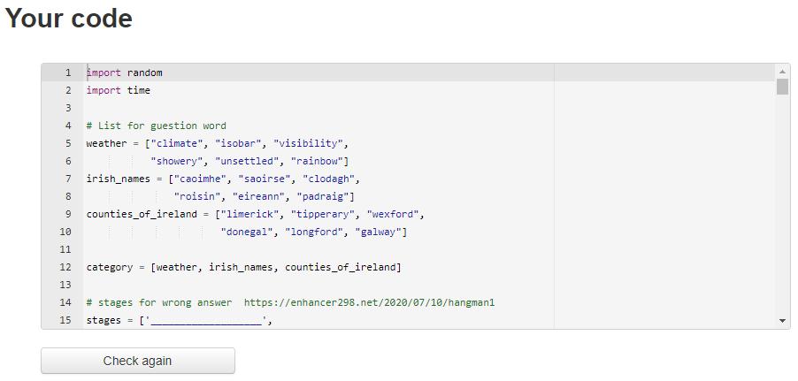

# HANGMAN game

This game ws built as part of the learning material for Code Institute's Fullstack Web Developer program (5P) Portfolio Project.

Hangman is an old school favorite, a word game where the goal is simply to find the missing word or words Python terminal game, which runs in the Code Institute mock terminal on Heroku.

You can check out the live game [here](https://hangman-game1x.herokuapp.com/)

# How to play

* If you know how to play the game you can start game, otherwise you can read about how to play the game.

* You will have to make a choice what category to select

* You will be presented with a number of blank spaces representing the missing letters you need to find.

* Use the keyboard to guess a letter (I recommend starting with vowels).

* If your chosen letter exists in the answer, then all places in the answer where that letter appear will be revealed.

* After you've revealed several letters, you may be able to guess what the answer is and fill bit more easy in the remaining letters.

* Every time you guess a letter wrong you loose a life and the hangman begins to appear, piece by piece.

* To win you need to solve the puzzle before the hangman dies.

# Features

### Exsisting Features

### Future Features

* Hangman game is old, old game and the word at current childrens play list can be odd. Taking consideration mental health and suitside issues. So for that reason I would give different visualisation option where you can select build a snowman or melting snowman.

* more categorys to select

* bigger list of words. Special file to accomodate that.

* for a language lerning purpose was be good to hear this word sound.

* the letters can be displayed for selection

* different difficulty levels 

# Data Model

The flowchart below summarises the data flow in this program.
 Pilt sisse

# Technology

*  This game was created with:

    * [Gitpod](https://www.gitpod.io/) used to develop project and organise version control 

    * [Github](https://github.com) used to host repository
       
    * [Heroku](https://id.heroku.com/login) used for app deployment from Github

* The Code Institute's GitHub full template for Python is used in order for the program to display properly in the deployed site on Heroku.

* [random](https://docs.python.org/3/library/random.html) to randomize anagram

* [time](https://docs.python.org/3/library/time.html) to slow down printed statements

* Python 3 - an interpreted high-level general-purpose backend programming language.

# Testing

I have manually tested this project by doing the following:
* Passed the code through a PEP8 linter and confirmed, there are no problems
* Give invalid inputs strings when numbers are expected, out of bound inputs, some inputs twice
* Tested in my local terminal and the Code Institute Heroku terminal
* [Python tutor](https://pythontutor.com/visualize.html#mode=edit)

## Bugs

### Solved Bugs

## Remaining Bugs

* No bugs remaining

## Validator Testings

* [PEP8](http://pep8online.com/checkresult)
    * No errors were returned from PEP8online.com

    

# Deployment

# Credits

* Code Institute for the deployment terminal
* 
## Reminders

* Your code must be placed in the `run.py` file
* Your dependencies must be placed in the `requirements.txt` file
* Do not edit any of the other files or your code may not deploy properly

## Creating the Heroku app

When you create the app, you will need to add two buildpacks from the _Settings_ tab. The ordering is as follows:

1. `heroku/python`
2. `heroku/nodejs`

You must then create a _Config Var_ called `PORT`. Set this to `8000`

If you have credentials, such as in the Love Sandwiches project, you must create another _Config Var_ called `CREDS` and paste the JSON into the value field.

Connect your GitHub repository and deploy as normal.

## Constraints

The deployment terminal is set to 80 columns by 24 rows. That means that each line of text needs to be 80 characters or less otherwise it will be wrapped onto a second line.

-----
Happy coding!